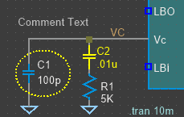

# LTSpiceThemer
An easy to use GUI to change the theme of LTSpice circuit simulator.

My goal with this was to create a simple tool to tweak the themes of the LTSpice simulator so that I could use screenshots to make nice looking presentations.

As it may be useful for others, I am making the binary and code available with MIT license.

I hope you find it useful too :D.

If you want to reach me, here is my [LinkedIn](https://www.linkedin.com/in/leandro-da-silva-38a084ba/).

## Available themes

[default] - LTSpice Default theme  
[sakabug] - theme from https://github.com/sakabug/LTspice-themes  
[twilight-after-dawn] -  theme from https://gist.github.com/metacollin/99f994237af90a7b5ebf82581e01a507  
[dracula] - theme from https://github.com/dracula/ltspice  
[softdark] - theme from https://github.com/johan162/themeltspice  
[blackwhite] - theme from https://github.com/johan162/themeltspice  
[redblack] -  theme from https://github.com/johan162/themeltspice  
[bbking] -  theme from https://github.com/johan162/themeltspice  
[blackred] -  theme from https://github.com/johan162/themeltspice  

## Important

Releases can be found under [Releases](https://github.com/dasilvaleandro21/LTSpiceThemer/releases).

Release 1.0.0.0 can only change the schematic colors (not waveform viewer or netlist).  

More themes (and ability to change waveform/netlist colors) are coming soon.

## Screenshots

- App window:  

- Default:  

- Sakabug:  

- Twilight-after-dawn:  

- Dracula:  

- Softdark:  

- Blackwhite:  

- Redblack:  

- BBking:  

- Blackred:  
